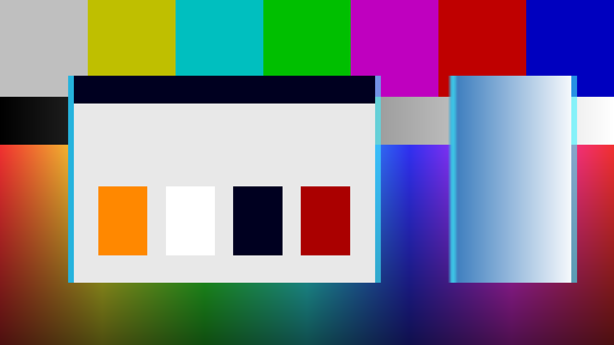

# Genlock

> **AI-assisted project.** This codebase was created with [Claude](https://claude.com/claude-code)
> (Anthropic), directed and reviewed by a human author. The timing model is not
> asserted but measured: an offline harness drives the real plugin class in a
> headless GL context, with **two** input textures at two different resolutions,
> and checks each claim against an independent statement of the same arithmetic
> — a whole-pixel key delay translating the key **exactly, 0 of 164 bytes
> different**, a fractional one recovered from partial coverage at **0.4941
> output texels against a predicted 0.5000**, the crawl following the closed
> form its clock error predicts to **0.0176 texels over 30 frames**, the
> roll landing **within 0.0000 rows** at two different rasters, and the crawl's
> speed across the picture **bit-identical** in lores, hires and superhires (see
> [Status](#status)). It has **never been loaded into Resolume**, on any
> platform — not once. It is the fleet's first FFGL *mixer*, and several things
> about how a host treats one are still guesses. Check it in your own rig before
> trusting it in a show.

An Amiga genlock — flaws and all — as an FFGL **mixer** for
[Resolume](https://resolume.com) Arena and Avenue.



<sub>The repo's two test cards through the plugin at a three-pixel key delay —
rendered by `gltest`, the offline harness, not captured from Resolume. The band
down every graphic's edges is where the key and the fill disagree: at a left
edge it is the palette's colour 0 laid over the video, at a right edge it is
video cut into the graphic, and Edge Tint has coloured both.</sub>

## The key comes from the wrong clock

That is the whole design, and everything else follows from it.

An Amiga genlock keys the computer's colour 0 over incoming video. The video
sets the timing. **The computer does not follow it** — the key is cut on the
Amiga's own pixel clock, which free-runs a few parts per million away from the
video's. So the key edge arrives a pixel or so from the fill it belongs to, and
because the two clocks differ, that error walks.

- **A coloured fringe** down one side of every overlay edge. Where the key says
  "computer" and the fill is still colour 0, the palette's background lands on
  the video. Where it says "video" and the fill is already the graphic, video
  cuts into the graphic. Which one you get is the **sign** of `Key Delay`, and
  both are things that really happened.
- **The fringe crawls.** `Clock Error` is in parts per million, and the crawl
  rate falls out of it: the Amiga's 7.09379 MHz lores pixel clock times the
  fractional error. A real genlock re-locks on every line sync, so only the
  remainder survives — the fringe walks as far as `Crawl Wrap` allows (one
  Amiga pixel by default) and snaps back, over and over. At 0.01 ppm one lores
  pixel takes fourteen seconds; at 50 ppm, an ordinary crystal's tolerance, it
  is a blur.
- **Loss of vertical lock.** Drop `Sync Quality` below half and the overlay
  rolls at `Roll Rate` and tears at the seam. The video does not move — the
  overlay is the thing that has lost lock.
- **A three-position fader**, because that is what the hardware had: Video,
  Overlay, Dissolve, and a dissolve pot.

[resolume-luma-keyer](https://github.com/stoatworks-labs/resolume-luma-keyer) is
the keyer that works. Here the flaws are the product.

**It is a mixer, not an effect.** It needs a layer below it: that layer is the
incoming video, and the clip on this layer is the computer's picture.

## The controls

**Key** — Key Source (Colour 0, Luma or Alpha), Key Colour as a swatch (the
default is Workbench blue, `#0055AA`), Tolerance, Softness and Invert.

**Timing** — Amiga Mode (Lores, Hires or Superhires), Key Delay (−8 to +8
Amiga pixels, signed; negative lays colour 0 over the video, positive cuts video
into the fill), Clock Error (0.01 to 50 ppm, geometrically), Crawl Rate, Crawl
Wrap (1 to 16 Amiga pixels: how far the fringe walks before the line sync
pulls it back — one is a genlock that re-locks cleanly, sixteen is the length
of the PAL colour burst it locks to), Sync Quality and Roll Rate.

One Amiga pixel is 1/320 of the picture width in lores, 1/640 in hires and
1/1280 in superhires, at every raster — an Amiga line is that many pixels
across the active picture whatever the monitor is, so a one-pixel fringe is the
same fraction of the frame at 720p and at 4K. The mode decides what an "Amiga
pixel" means, and it moves only what the computer counts in its own pixel
clocks: Key Delay and Crawl Wrap are half the distance in hires and a quarter
in superhires. The crawl's *speed* across the picture and the tear's throw are
time errors in the incoming video, and are the same in every mode. The defaults
— lores, a one-pixel wrap — render exactly what the plugin rendered before
either control existed.

**Fader** — the three-position switch, and the Dissolve pot that only exists at
the Dissolve position.

**Look** — Fringe and Edge Tint, which colour the band where the key and the
fill disagree (the disagreement is there without them; real hardware puts chroma
crosstalk on it, and this is where you say how much), and Opacity.

## Build

Needs CMake and the Resolume FFGL SDK, which is a submodule.

```bash
git clone --recursive https://github.com/stoatworks-labs/genlock
cd genlock
cmake -B build -DCMAKE_BUILD_TYPE=Release
cmake --build build
cmake --install build    # → ~/Documents/Resolume Arena/Extra Effects
```

macOS builds universal (arm64 + x86_64) by default. Add
`-DCMAKE_OSX_ARCHITECTURES=arm64` for a faster development build.

The install path is **Extra Effects**, although this is a mixer. Resolume has one
FFGL folder, and sources, effects and mixers all load from it: Arena 7's binary
names no other, and the FFGL SDK sends its own mixer example there. (Before
v0.1.0 this said `Extra Mixers`, which Arena never reads.)

## Building and testing

The harness renders the real plugin class headlessly. It is the first in this
fleet to drive **two** inputs — `--input-a` is Dest, the layer below;
`--input-b` is Src, this layer — and they may be different sizes, with different
hardware padding, rendered to an output that is a third size again.

    ./build/gltest --out /tmp/frame.png     both cards, through the plugin
    ./build/gltest --list                   every parameter, kind and default
    ./build/gltest --mixer                  two inputs, two MaxUVs, and the guards
    ./build/gltest --delay                  the key's lag behind the fill
    ./build/gltest --crawl                  the delay walking, against the closed form
    ./build/gltest --roll                   the roll and its wrap, at two rasters
    ./build/gltest --fader                  what "the output IS Dest" is worth
    ./build/gltest --modes                  what Amiga Mode and Crawl Wrap scale, at two rasters
    ./build/gltest --defaults               the new controls' defaults ARE the old behaviour
    ./build/gltest --mutation               one character of the shipped GLSL fails a check
    ./build/gltest --bench                  720p through 4K
    python3 tools/sweep.py                  no control is silently dead
    tools/verify.sh                         all of it, on a fresh universal build

Every tolerance in there is derived from something physical — one output texel,
one source texel, one 8-bit code, the raster's own height — rather than from the
number this machine printed first. A whole-texel displacement translates an
image exactly and is asserted as **byte equality**; a fractional one exists only
in the filter's interpolation and gets a derived tolerance. They are never
checked by the same measurement. [AGENTS.md](AGENTS.md) lists every number and
where it comes from.

## Status

**v0.1.0, unreleased, and honestly early.** Verified by measurement on an Apple
M4 Max, macOS 26.4.1, 2026-09-22; the Amiga Mode and Crawl Wrap rows
2026-09-23:

| Check | Result |
| --- | --- |
| Two inputs, two sizes, two MaxUVs | Dest 200×120 of 256×256, Src 96×70 of 128×128, out 320×200: **0 padding pixels** reached the picture, every quadrant within **0.000 of 255**, a known marker within **0.0006** of the picture (tolerance: one source texel) |
| The missing-input guards | a null input array, zero inputs, one input, a null Dest and a null Src all return `FF_FAIL` without crashing |
| Key delay, whole pixel | a 4-texel change translates the key **exactly — 0 of 164 bytes differ** |
| Key delay, fractional | half a texel recovered from partial coverage at **0.4941 against 0.5000**; tolerance 0.25, derived bound 0.031 |
| The fill does not move | **0 bytes** across three delays past the edge, **0 bytes** over the whole frame with the key off, and at zero delay the fringe provably does nothing |
| Crawl | at 1.127747 ppm the predicted rate is **7.999999 Amiga px/s**; the reduced phase matches the closed form to **0.000e+00** and the key edge to **0.0176 output texels** over 30 frames, wrapping **3 times** as predicted |
| Roll | at **two rasters** — 640×360 (6 whole rows/frame, 23 of 23 exact rotations) and 480×270 (4.5 rows/frame, 11 exact and 12 fractional) — worst **0.0000 rows**, tolerance 0.05; byte-identical after one period |
| Loss of lock | a branch, not a fade: locked, two frames a second apart are byte-identical |
| Fader at Video | **bitwise** Dest, 0 bytes, at matched rasters — for a stated reason. At an unmatched raster it is a resample and no claim is made |
| Amiga Mode: the crawl | its speed across the picture is **bit-identical** in lores, hires and superhires — in the arithmetic, in the plugin's own phase, and in the rendered frames byte for byte over 24 frames — and follows the lores physics to **0.0083 texels** at 640×360 and **0.0619** at 320×180 |
| Amiga Mode: Key Delay | −8 of the mode's pixels moves the key **−16.0024 / −8.0024 / −4.0024** texels at 640×360 (predicted −16 / −8 / −4), and hires at −8 is lores at −4 **byte for byte** |
| Amiga Mode: the tear | the same throw in every mode: **−28.1294** texels at 640×360 against −28.1333 predicted, and the torn frames identical |
| Crawl Wrap | at 4 pixels of the mode: **3** wraps in lores and **6** in hires over 60 frames, as predicted; the key walks **7.933 of 8.000** texels before it snaps |
| Negative controls | each of the four mode claims re-run against a plugin with the wrong answer built in **fails in the picture**, at both rasters; a one-character mutation of the shipped GLSL fails the Key Delay check |
| The defaults are the old plugin | the crawl and delay match the pre-feature formula **bit for bit** over 60 frames; and against the previous commit's own harness, eight scenes rendered **byte-identical PNGs** (checked once, by hand) |
| No dead controls | all **21** sweepable of the 26 parameters measurably change the picture, at 480×270 and 320×180; the other five are the About text and its buttons, which `tools/sweep.py` skips |
| macOS binary | a local build is universal (`x86_64 arm64`), exports `plugMain`, and ad-hoc signs |
| Host metadata | `oxbow probe` reads **SW Genlock / GL01 / mixer / inputs 2..2 / 26 params**, and loading it that way writes the load-time log line naming the bundle |
| Render cost | **under 0.12 ms/frame at 4K** — 0.7% of a 60 fps frame. One pass and three texture fetches is so cheap that repeated runs vary by a factor of two (0.04 to 0.12 ms at 4K, 0.024 to 0.036 at 1080p); the figure worth quoting is the ceiling, not a mean |

Run `tools/verify.sh` before believing any of it.

**Not done, and the honest list is long.** It has **never been loaded into
Resolume** — not on macOS, not on Windows, not once — so every mixer-specific
claim about the *host* is a guess: that it binds a parameter named `Opacity` to the transition position (the SDK's
own example says it does, which is why the master blend carries that name
instead of the `Mix` it would otherwise have), that it calls a mixer with one
input while the operator is patching, and that it drives a mixer's clock at all.
The **Windows build has never been compiled**; CI exists and has never run,
because there is no remote. Nothing has run on a **rasteriser other than this
Mac's** — the tolerances are derived from the OpenGL specification rather than
fitted to a measurement, precisely so that they survive a GPU-less runner, but
derived is not proven. Premultiplied alpha is assumed rather than measured. The
**tear** at the roll seam is a look, not a model: nothing measures it and no
real hardware was consulted. There are **no presets**, no OpenFX port, no
browser demo and no user guide — which is why the About block deliberately
carries no guide link. `StoatworksAbout.h` and `ATTRIBUTIONS.md` are provisional
hand copies.

**Amiga Mode and Crawl Wrap are arithmetic, not observation.** The rule — pixel
clocks scale with the mode, time errors do not — is argued in `Controls.h` and
measured against itself; nobody has compared a hires Workbench through a real
genlock, and a composite-rate genlock's real bandwidth may make superhires look
nothing like a quarter-size lores fringe. The 16-pixel ceiling on Crawl Wrap is
derived from the length of the colour burst, not measured on any genlock. PAL
only: no NTSC.

**The log is ready for the first Arena session and has never been read from
one.** It records where the host loaded the bundle from, the host's name and
version, whether a mixer is called with one input, whether its clock is driven
and in what unit, and whether `Opacity` moves with the transition — the open
questions above. [AGENTS.md](AGENTS.md) says what each line answers.

[AGENTS.md](AGENTS.md) has the full list of what is assumed rather than
measured, the open questions, the traps, and the fleet's only written account of
how an FFGL mixer actually behaves.

<!-- attributions:start -->
This project is built on other people's work — see [ATTRIBUTIONS.md](ATTRIBUTIONS.md).
<!-- attributions:end -->

## Licence

MIT — see [LICENSE](LICENSE) and [ATTRIBUTIONS.md](ATTRIBUTIONS.md).
